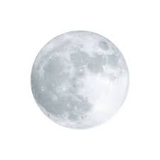

<a name="https://www.linkedin.com/in/fatiha-laaouafi-4227252ba/"> linkdin</a>

<!-- logo-->
 

  
  <h1>Weather frocast </h1>

  <h3 align="center"> endeavor to create a personal forecast</h3>

  

    a new online program that updates with the most recent weather forecast based on your past selections.      
    <a href="https://github.com/LAAOUAFIFATIHA"><strong>Explore the docs</strong></a>
     
     
  

<!-- ABOUT THE PROJECT -->
## About The Project

For our research, a variety of data must be gathered and analyzed. First, we can obtain weather data for each day, week, month, or year from the API where we obtain the information. Subsequently, we gather user data that includes likes and dislikes for the daily weather. This data is loaded into a SQLMyAlchemy database, allowing us to forecast whether or not the user will enjoy the second weather.

 

  

 

By providing a more precise and effective means of anticipating weather patterns, this system solves the shortcomings of current weather forecasting techniques. By concentrating on the user's expenses and crucial atmospheric conditions.to boost efficiency and raise the precision of weather predictions.

(<a href="#readme-top">back to top</a>)

## Project Context

Our project entails a thorough examination of the options that the user has selected. It also gives the user the chance to generate his own data, which helps our program learn from it and predicts whether the user will like the weather or not.

    

 
## Project Architecture

    

 

Python is the main language used in the implementation of our project, with Flask serving as the framework. HTML and CSS are used for the interface's implementation to provide the greatest possible user experience while maintaining interface simplicity.

## Project Results

By using the user's past data, the project can now determine whether or not the user would enjoy the weather.

    

<!-- GETTING STARTED -->
## Getting Started

<!-- CONTRIBUTING -->
## Contributing
# install VS 
in the terminal of VS 
istall flask 
>>> pip install flask
>>> pip install jinja2

Contributions are what make the open source community such an amazing place to learn, inspire, and create. Any contributions you make are **greatly appreciated**.

(<a href="#readme-top">back to top</a>)

